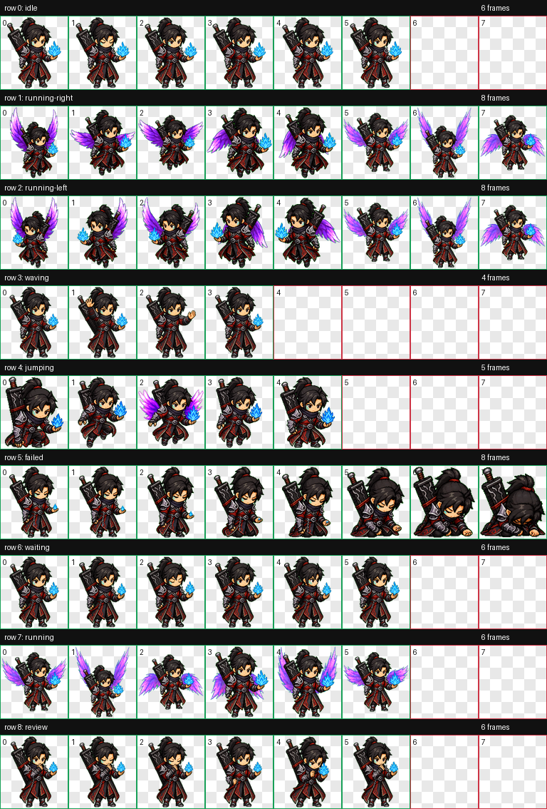

# XiaoYan Codex Pet / 萧炎 Codex 宠物

一个自制的 Codex 小宠物包，形象灵感来自萧炎：红黑衣甲、玄重尺、蓝色异火和紫粉色火翼。

## 预览



## 安装方法

下载这个仓库，然后把 `xiaoyan` 文件夹复制到你的 Codex 宠物目录。

### Windows

```text
C:\Users\<你的用户名>\.codex\pets\xiaoyan
```

最终目录里应该包含这两个文件：

```text
pet.json
spritesheet.webp
```

复制完成后，重启 Codex 或刷新宠物列表。

## 文件结构

```text
xiaoyan/
  pet.json
  spritesheet.webp

preview/
  contact-sheet.png
```

## 说明

这是一个粉丝自制的原创 Codex 宠物包，仅供个人使用与分享。

---

## English

A custom Codex pet inspired by XiaoYan: red-black armor, a heavy ruler, blue hand flame, and purple-pink flame wings.

### Preview


### Installation

Download this repository, then copy the `xiaoyan` folder into your Codex pets folder.

#### Windows

```text
C:\Users\<your-username>\.codex\pets\xiaoyan
```

The final folder should contain:

```text
pet.json
spritesheet.webp
```

Restart Codex or refresh the pet list after copying the folder.

### Files

```text
xiaoyan/
  pet.json
  spritesheet.webp

preview/
  contact-sheet.png
```

### Note

This is a fan-made original Codex pet package for personal use and sharing.
